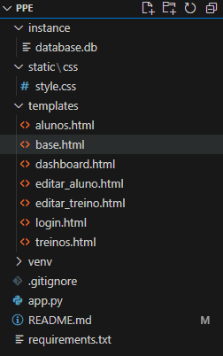

# RA FITNESS - Sistema de Gerenciamento de Academia

O **RA FITNESS** é um sistema web simples, desenvolvido com **Python (Flask)** e **Bootstrap**, para gerenciar alunos e seus respectivos treinos em uma academia. O sistema inclui funcionalidades de **autenticação** de usuário (login/logout), **CRUD** (Criação, Leitura, Atualização, Exclusão) para alunos e treinos, e um tema visual que suporta **modos claro e escuro**.

---

## Funcionalidades Principais

* **Autenticação Segura:** Login e Logout de usuários com senhas criptografadas (usando `flask-bcrypt`).
* **Gerenciamento de Alunos:** Adicionar, visualizar, editar e excluir alunos (nome, idade, plano).
* **Gerenciamento de Treinos:** Adicionar, visualizar, editar e excluir treinos específicos para cada aluno (descrição, séries, repetições).
* **Interface Responsiva:** Utiliza **Bootstrap 5** para uma experiência agradável em diferentes dispositivos.
* **Tema Claro/Escuro:** Alternância de tema com persistência local (`LocalStorage`).

---

## Estrutura do Projeto



---

## Tecnologias Utilizadas

* **Backend:** Python 3, Flask
* **Banco de Dados:** SQLAlchemy (SQLite)
* **Autenticação:** Flask-Login, Flask-Bcrypt
* **Frontend:** HTML5, CSS3, Bootstrap 5

---

## Configuração e Instalação

Siga os passos abaixo para configurar e rodar o projeto em sua máquina local.

### 1. Clonar o Repositório

Certifique-se de que a estrutura de diretórios (como mostrado acima) está correta em sua máquina.

### 2. Configurar o Ambiente Virtual (`venv`)

É altamente recomendável utilizar um ambiente virtual para isolar as dependências do projeto.

```bash
# Navegue até o diretório raiz do projeto
cd [caminho/para/ra-fitness]

# Crie o ambiente virtual (venv é o nome sugerido)
python -m venv venv

# Ative o ambiente virtual

# No Windows
.\venv\Scripts\activate

# No Linux/macOS
source venv/bin/activate
3. Instalar as Dependências
Com o ambiente virtual ativado, instale todas as bibliotecas necessárias listadas no requirements.txt:

pip install -r requirements.txt
As dependências principais são: Flask, Flask-SQLAlchemy, Flask-Login, e Flask-Bcrypt.

4. Inicializar o Banco de Dados e Usuário Admin
O arquivo app.py está configurado para criar o banco de dados e um usuário inicial automaticamente na primeira execução.

Usuário	admin
Senha	senha123

Exportar para as Planilhas
5. Rodar a Aplicação
Execute o arquivo principal da aplicação.

python app.py
Você deverá ver a mensagem no console:

Usuário 'admin' criado com senha 'senha123'
...
* Running on [http://127.0.0.1:5000](http://127.0.0.1:5000) (Press CTRL+C to quit)
...
6. Acessar o Sistema
Abra seu navegador e acesse o endereço:

http://127.0.0.1:5000/

Faça login com as credenciais iniciais: admin / senha123.

📝 Detalhes Técnicos
Modelos (Models)
Os modelos ORM estão definidos no app.py:

User: Para autenticação de usuários.

Aluno: Armazena os dados do aluno.

Treino: Armazena os exercícios, com uma relação de chave estrangeira com Aluno.

Segurança
A chave secreta (app.config['SECRET_KEY']) deve ser alterada para uma string aleatória e complexa em produção.

As senhas dos usuários são armazenadas como hashes usando Flask-Bcrypt.

As rotas importantes são protegidas com o decorador @login_required.

Personalização Visual
O arquivo style.css utiliza variáveis CSS para fácil customização e temas:

--pink-primary: #ff69b4 (Pink Principal)

--pink-secondary: #ffb6c1 (Pink Claro)

--pink-gradient: Gradiente de cor usado nos componentes principais.
```
Modo Escuro
O tema escuro é implementado com variáveis CSS em html.dark-theme e gerenciado via JavaScript, persistindo a escolha do tema no localStorage.